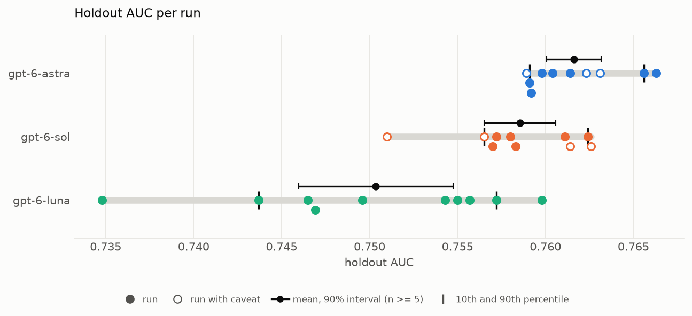
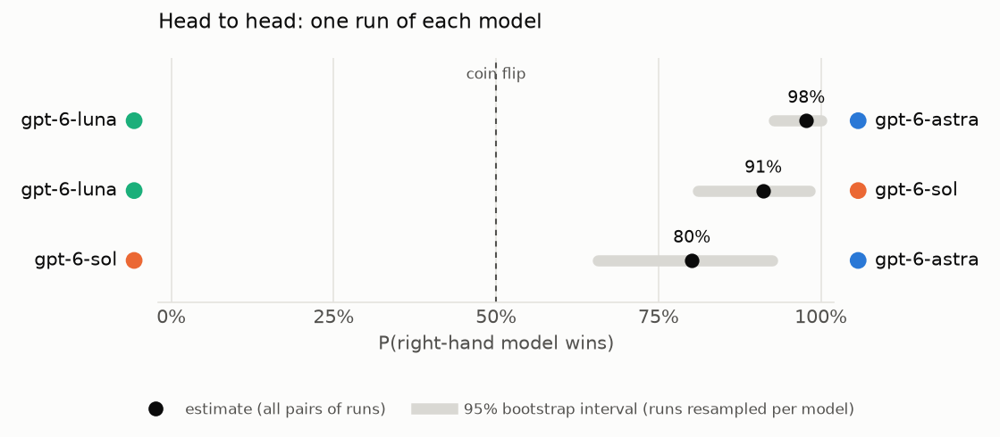
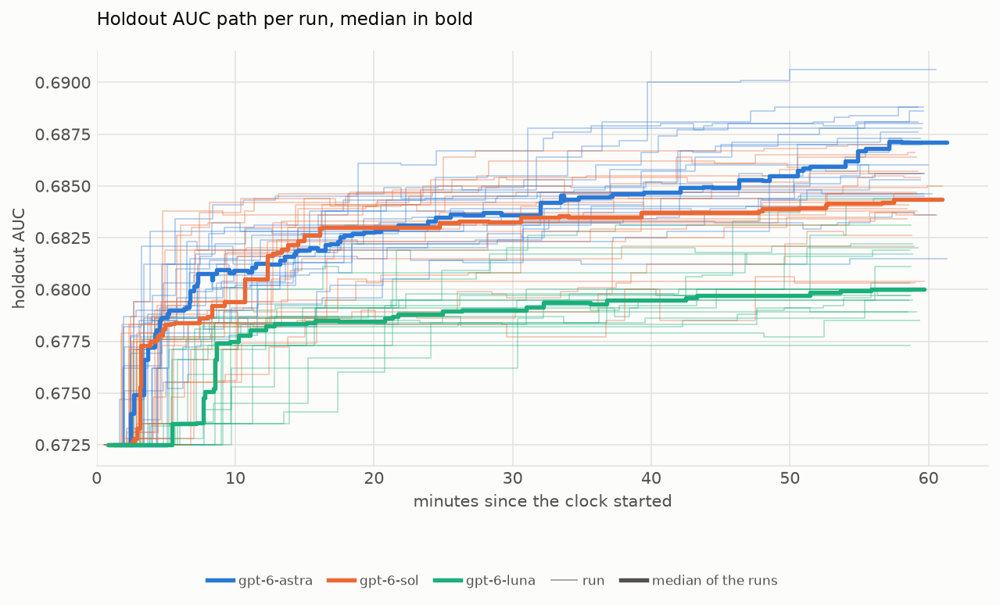
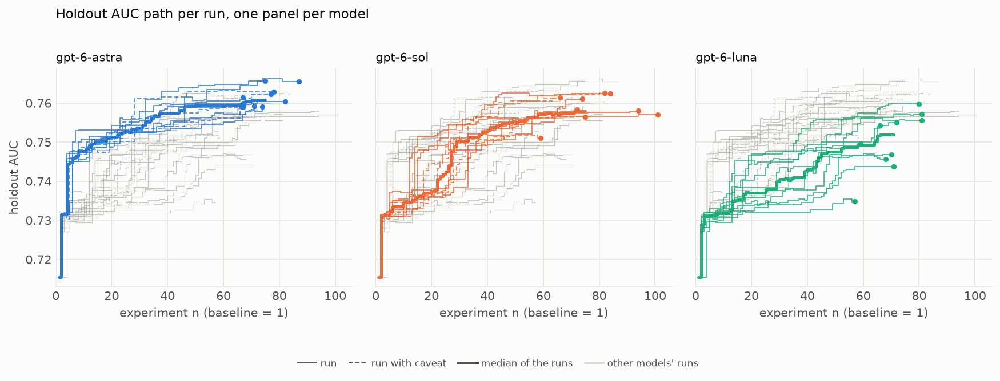

## One Run Is Not Enough: How Much AI Agent Results Vary  in Data Science, an XGBoost Optimization Study

#### by Szilard Pafka and Eduardo Ariño de la Rubia

**TL;DR** We used an AI coding agent powered by three different large language models (LLMs) to autonomously tune an XGBoost model, running each LLM 20 times with the same setup and the same instructions. Every run improves the starter model, and on average the three LLMs rank clearly against one another. But results vary a lot from run to run, so much that the ranges of the different LLMs overlap. One run of a given setup is therefore not enough, either to judge how well an agent performs or to compare LLMs.

---

In a [previous project](https://szilard.github.io/xgboost-autoresearch/) we showed that AI coding agents can automate much of a data scientist's trial-and-error work: they research ideas, engineer features, tune the hyperparameters of an XGBoost model, and keep what works. However, the results we presented came from single runs of a single agent, and AI agents are not deterministic: given the same task twice, the same agent will try different ideas, in a different order, and end up with a different model. So a single run is just one sample from a wide range of possible outcomes. It does not necessarily tell us how good a setup really is, or whether one LLM is better than another. To answer those questions, we rebuilt the project into a minimal, self-contained building block for a single run, and added an orchestrator that runs it many times, fully automatically.

The task is similar to the second scenario of the previous project: predict whether a flight will be delayed, using airline data, with a model trained on flights from 2005 and evaluated on flights from 2006. The agent has 1 hour to improve a starter XGBoost model on its own. It searches the web for ideas, edits the code to engineer new features and tune the hyperparameters, keeps a change if it beats the best AUC (area under the ROC curve) so far on an evaluation set of 2006 flights (or matches it with simpler or faster code) and discards it otherwise. Every model the agent keeps is then scored on a separate holdout set of other 2006 flights that the agent never sees, so we measure how well the models really generalize, not just the score the agent was optimizing. Compared to the previous project, the single-run building block ([xgboost-autoresearch-minimal3](https://github.com/szilard/xgboost-autoresearch-minimal3)) is simpler and more standardized. The orchestrator ([xgboost-autoresearch-minimal3-runs](https://github.com/szilard/xgboost-autoresearch-minimal3-runs)) runs the experiment repeatedly without any human steering: each run starts in a fresh, isolated Docker container with identical instructions, the holdout data and the scoring scripts are out of the agent's reach until it has finished, and automatic checks afterwards verify that the agent followed the rules. With this, we ran OpenAI's Codex agent (on a ChatGPT subscription) 20 times with each of three OpenAI models, gpt-6-luna, gpt-6-sol and gpt-6-astra (Luna, Sol and Astra for short). All runs used the "max" reasoning effort setting, Luna's highest; Sol and Astra have one more level, "ultra", above it.

The first plot shows, for each run, the holdout AUC of its final model, the kept model with the highest evaluation AUC. Higher is better; the starter model scores 0.6725 on the holdout set. (No run had to be excluded: the automatic integrity checks flagged 10 runs, but every flag turned out to be a false alarm on review. Minor caveats, from a separate review of the protocol, apply to 10 runs: 9 kept a change that only tied the best evaluation AUC so far without making the code simpler or faster, and one lost over 3 minutes of its hour to retries while its LLM was at capacity. All 60 runs are shown alike.) The black dot with whiskers marks each LLM's mean with its 95% confidence interval, which shows how precisely we know the average, while the short vertical ticks mark the 10th and 90th percentiles, which show the spread of single runs. The grey bar spans each LLM's full range, from its worst to its best run. On average the three LLMs rank clearly (the confidence intervals for the means do not overlap): Astra comes first, then Sol, then Luna. But the runs of each LLM are spread widely. Each LLM's best and worst runs are 0.007 to 0.009 AUC apart. For each LLM, this range is more than half of its average improvement over the starter model (an improvement of 0.008 for Luna, 0.012 for Sol and 0.014 for Astra), and more than the 0.006 between the averages of the best and the worst LLM. The ranges also overlap: Luna's best run beats half of Sol's runs and the two worst runs of Astra, and Sol's best run beats half of Astra's runs.

The second plot shows how reliably one run of each LLM ranks the two LLMs right. For each pair of LLMs, it gives the probability that a randomly picked run of the LLM that is better on average beats a randomly picked run of the other one. Astra beats Luna in 98% of pairings and Sol beats Luna in 91%, but Astra beats Sol in only 80%: Sol still wins one pairing in five. These are point estimates from 20 runs per LLM; the grey bars in the plot (95% bootstrap intervals) show how uncertain they are. So comparing two LLMs based on a single run each would give the wrong answer surprisingly often, even when one of them is clearly better on average.

The next two plots show how this variation builds up over the hour. Each thin line traces one run over its hour, and each step is a change the agent kept: usually up, but sometimes down, when a gain on the evaluation set does not carry over to the holdout set. The bold lines are the median of each LLM's runs; in the panels, the other two LLMs' runs are drawn in grey behind each LLM's own. Most runs make the same move early on: shallower trees (depth 4 instead of 6, often with more trees at a lower learning rate). This lifts the holdout AUC from 0.6725 to about 0.678. Simply adding trees at the starter's learning rate, by contrast, lowers the evaluation AUC on this data: a model that fits the training year more closely does worse on the next one. The medians of Sol and Astra make their first gain within about 3 minutes and are neck and neck at the half hour; after that Sol's median barely moves, while Astra's keeps climbing, so most of the gap between the two opens in the second half hour. Luna gets going later, runs fewer experiments in the hour, kept or discarded (30 on average, against 45 for Sol and 47 for Astra), and its median stays around 0.678 to 0.680 from 15 minutes on. Beyond the medians, the paths of single runs diverge: some runs find a key idea early and climb quickly, while others get stuck on a plateau for 20 minutes or more.

Part of the gap between the LLMs, above all Luna's gap to the other two, comes down to how they handle the calendar. The starter model treats the month and the day of the month as categories, so together they identify the exact date, which lets the model pick up patterns of particular days of 2005 that do not carry over to 2006. Astra dropped the day-of-month category in 19 of its 20 runs, often among its first changes, and 15 of its 20 final models use holiday features instead (such as the number of days to the nearest holiday). Sol dropped it in 13 runs, mostly in favor of the day of the year as a number, and Luna in only 4, its three best runs among them. Within Luna's runs and within Sol's, those that dropped it score about 0.003 higher on the holdout set on average than those that kept it. But a good idea alone does not guarantee a good result: Astra's weakest run also dropped the day-of-month category and used holidays. How far a run gets therefore depends partly on luck: which ideas the agent happens to try, in what order, and how well it follows them up.

In conclusion, today's AI agents consistently improve the model on data science tasks like this one (all 60 of our runs beat the starter model on the holdout set), but the size of the improvement varies a lot from run to run, even with identical setup and instructions. This has two practical consequences. First, to compare agents, LLMs, prompts or any other part of the setup, one run is not enough. You need repeated runs and should look at the distribution of the results, not a single number. Second, if you just want a good model, it pays to run the agent several times and keep the run with the best evaluation AUC, which in our runs chose as well as the holdout set would have. Then confirm the chosen model on data that neither the agent nor your selection has touched, for an unbiased estimate of its performance. Both the [single-run building block](https://github.com/szilard/xgboost-autoresearch-minimal3) and the [multi-run orchestrator](https://github.com/szilard/xgboost-autoresearch-minimal3-runs) are open source, so you can use them to test your own agents, LLMs and setups, ideally with more than one run each.

License: [CC BY 4.0](https://github.com/szilard/xgboost-autoresearch3/blob/main/docs/LICENSE.md)

